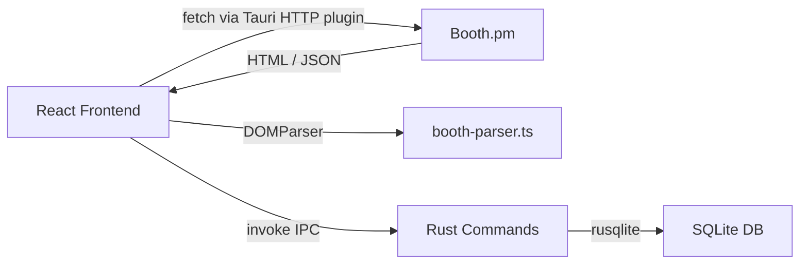

# AGENTS.md

## Project Overview

BoothHunter — Tauri 2 desktop app for searching and managing VRChat items from Booth.pm.

- **Frontend**: React 19 · TypeScript 5.9 · Vite 7 · Tailwind CSS 4 · TanStack React Query
- **Backend**: Rust (Tauri 2.9.5) · SQLite (rusqlite, WAL mode) · Tokio
- **Routing**: React Router DOM 7
- **Icons**: Lucide React
- **No testing framework, ESLint, or Prettier configured**

## Architecture

**Data flow**: The frontend fetches Booth.pm directly (bypassing CORS via Tauri's HTTP plugin), parses HTML/JSON in the browser, then persists data to SQLite through Tauri IPC commands.

## Project Structure

- `src/pages/` — route-level page components
- `src/components/{domain}/` — feature-grouped components (search, favorites, layout, common)
- `src/hooks/` — custom hooks wrapping TanStack Query
- `src/lib/` — API layer, types, parsers, constants, utilities
- `src-tauri/src/commands/` — Rust IPC command handlers (db, collections, stats)
- `src-tauri/src/database.rs` — SQLite schema, migrations, seed data

## Commands

### Frontend

- `npm run dev` — start Vite dev server (port 1420)
- `npm run build` — type-check (`tsc`) + production build (`vite build`)
- `npm run preview` — preview production build

### Tauri

- `npm run tauri dev` — launch full desktop app in dev mode
- `npm run tauri build` — build distributable desktop app

### Rust (run from `src-tauri/`)

- `cargo fmt` — format Rust code
- `cargo clippy` — lint Rust code
- `cargo check` — type-check Rust code

## After Completing Code Changes

### Frontend changes

1. `npx tsc` — ensure no type errors
2. `npm run build` — ensure production build succeeds

### Rust changes (run from `src-tauri/`)

1. `cargo fmt` — format code
2. `cargo clippy` — ensure no lint warnings
3. `cargo check` — ensure compilation succeeds

## Code Conventions

### File Naming

- Components: PascalCase (`SearchBar.tsx`, `ItemCard.tsx`)
- Lib/utilities: kebab-case (`booth-api.ts`, `hangul-katakana.ts`)
- Hooks: camelCase with `use` prefix (`useSearch.ts`, `useFavorites.ts`)

### Component Pattern

- Functional components with `export default`
- Props via typed interface
- Hooks at top, handlers in middle, JSX return at bottom

### State Management

- **Server state**: TanStack React Query (queries + mutations with optimistic updates)
- **UI state**: local `useState`; React Context only for cross-component category selection
- **No global state library**

### Styling

- Tailwind CSS 4 utility classes inline in JSX (no CSS modules, no styled-components)
- All UI text defined in `src/lib/constants.ts`

### Rust

- `#[tauri::command]` attribute for all IPC handlers
- `AppError` enum via `thiserror` for error handling
- Raw SQL queries (no ORM)

## Git Commits

Never commit unless the user explicitly says to commit. Use conventional commit format.
